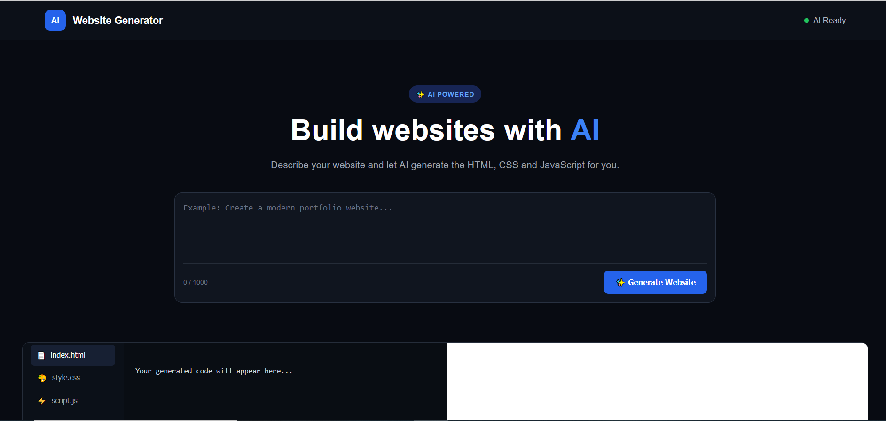

# 🤖 AI Website Generator

An AI-powered website generator that creates complete websites from natural-language prompts.

## 📸 Project Preview



## 🚀 Features

- Generate websites using AI
- HTML, CSS and JavaScript generation
- Live website preview
- Code viewer
- Copy generated code
- AI-powered website modification
- Responsive website generation
- Gemini API integration

## 🛠️ Technologies

- HTML
- CSS
- JavaScript
- FastAPI
- Python
- Gemini API

## ⚙️ How It Works

1. Enter a website description.
2. Gemini generates HTML, CSS and JavaScript.
3. Generated code appears in the editor.
4. The website is rendered in the live preview.
5. Users can modify the website using AI.

## 📂 Project Structure

```text
AI Website Generator/
├── backend/
│   ├── main.py
│   └── requirements.txt
│
├── frontend/
│   ├── index.html
│   ├── style.css
│   └── script.js
│
├── screenshot.png
├── README.md
└── .gitignore